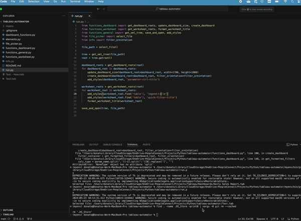

# README

## Setting Up Your Environment and Running the Application

### Step 1: Edit `info.py`

Open the `info.py` file in your preferred text editor. Add the desired filter orientation. You can choose either `vert` or `horz`.

### Step 2: Define the Logo File Path

Specify the logo `file_path` on your machine within the `info.py` file.

### Step 3: Set Up Your Dashboard

- Create a dashboard sheet and name it.
- Add the desired sheets to the dashboard and ensure they are floating.
- Add the desired filters, parameters, and legends to your dashboard, ensuring they are floating as well.

### Step 4: Run `run.py`

Execute the `run.py` file using the following command:

### Step 5: Select and Format the Tableau File

A Python application window will pop up. Select the desired Tableau file to format. The script will run and a new dashboard will open. The new file will be saved as `"Original Name - New.twb"`.

